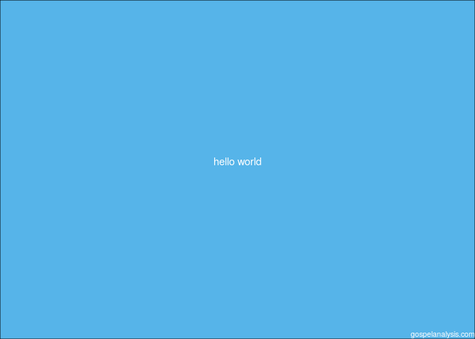
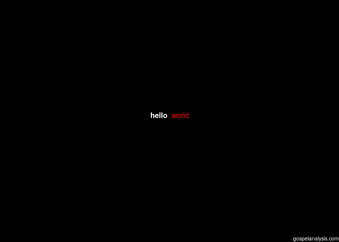
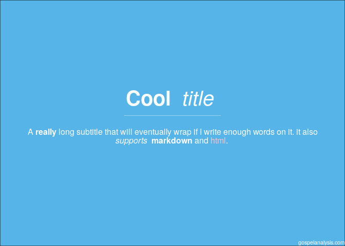

<!-- README.md is generated from README.Rmd. Please edit that file -->

# instaquote

<!-- badges: start -->
<!-- badges: end -->

The goal of instaquote is to make it easy to plot quotes in an image so
that you can export them to instagram/social media or in R markdown.

## Installation

<!--
You can install the released version of instaquote from [CRAN](https://CRAN.R-project.org) with:

``` r
install.packages("instaquote")
```
And the development version from [GitHub](https://github.com/) with:
-->

You can install the development version from
[GitHub](https://github.com/bryanwhiting/instaquote) with:

``` r
# install.packages("devtools")
devtools::install_github("bryanwhiting/instaquote")
```

## Example

This is a basic example which shows you how to solve a common problem:

``` r
library(instaquote)
## basic example code
txt <- 'hello world'
instaquote(txt)
```



Notice the watermark `gospelanalysis.com`. If anyone else besides me
uses this package, I’m happy to remove that. I just built it into the
default option.

You can customize with html:

``` r
txt <- '**hello** <span style="color:red">world</span>'
instaquote(txt, bg_color='black')
```



Generate custom text:

``` r
txt <- insta_text(
  title = '**Cool** _title_', 
  subtitle = 'A **really** long subtitle that will eventually wrap if I write enough words on it. it also _supports_ **markdown** and <span style="color:pink">html</span>.')
instaquote(txt)
```



# Kudos

-   `ggtext` and `ggplot2` power this project. Thanks to the awesome
    authors of those packages!
